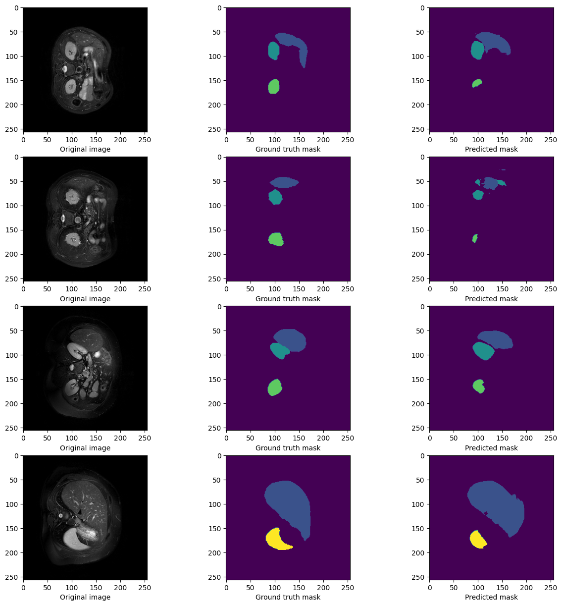

# Multi-Organ Segmentation in Abdominal MRI
This repository is the implementation of the MixAttNet for mullti-organ segmentation in Abdominal MRI.

**A Deep Attentive Convolutional Neural Network for Automatic Cortical Plate Segmentation in Fetal MRI.**  
*Haoran Dou, Davood Karimi, Caitlin K. Rollins, Cynthia M. Ortinau, Lana Vasung, Clemente Velasco-Annis, Abdelhakim Ouaalam, Xin Yang, Dong Ni, and Ali Gholipour.*   
IEEE Transactions on Medical Imaging, 2021. [[Paper]](https://ieeexplore.ieee.org/document/9303459) [[arXiv]](https://arxiv.org/pdf/2004.12847.pdf)  

  

## Usage  
### Dependencies  
This work depends on the following libraries:  
Pytorch 
Matplotlib 
Nibabel  
Numpy  
[Volumentations](https://github.com/ashawkey/volumentations)  

### Train and Test
Run the following code to train the network with arguments `--lr` (Learning Rate (default: 1e-4)), `--weight_decay` (Weight Decay (default: 1e-4)), `--batch_size` (Batch Size (default: 1)), `--num_class` (Number of classes (default: 5)), `--num_iteration` (Number of epochs (default: 100)), `--val_fre` (Validation Frequency (default: 2)), `--pre_fre` (Training loss print frequency (default: 10)), `--early_stopping` (Patience for early stopping (default: 50)), `--patch_size` (Patch Size (default: 128)), `--data_path` (Data Path (default: 'Data/')) and `--output_path` (Output Path (default: 'output/')). 
```
python Train.py
```
Run the following code to test the network with arguments `--weights` (Path to weights file (default: '/output/ckpt/best_val.pth.gz')), `--data_path` (Data Path (default: 'Data/')), `--output_path` (Output Path (default: 'output/')) and  `--num_class` (Number of classes (default: 5)).
```
python Infer.py
```
You can rewrite the DataOp.py to train your own data.

## Result

Cross Entropy Loss during training and Dice Score during validation :

 

Visual comparison of the segmentation results (image, prediction and ground truth)

During training :
 

During validation :
 

During inference :
 

Dice score pour l'inference :
 


## Relevant Resource
The relevant code can be also found at https://github.com/bchimagine/FetalCPSeg

## Bibliography  
```
@ARTICLE{9303459,
  author={H. {Dou} and D. {Karimi} and C. K. {Rollins} and C. M. {Ortinau} and L. {Vasung} and C. {Velasco-Annis} and A. {Ouaalam} and X. {Yang} and D. {Ni} and A. {Gholipour}},
  journal={IEEE Transactions on Medical Imaging}, 
  title={A Deep Attentive Convolutional Neural Network for Automatic Cortical Plate Segmentation in Fetal MRI}, 
  year={2021},
  volume={40},
  number={4},
  pages={1123-1133},
  doi={10.1109/TMI.2020.3046579}}
```
